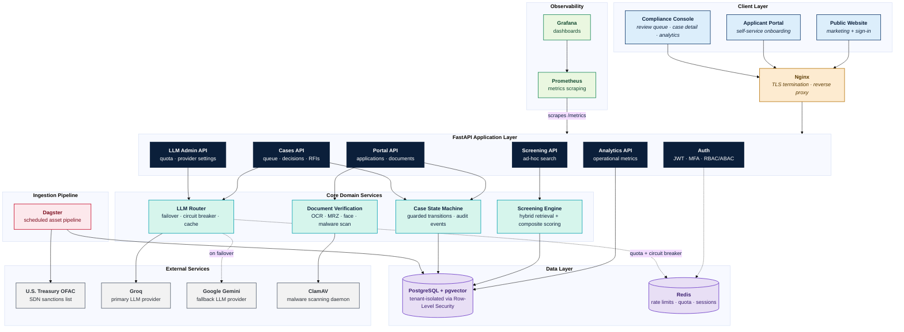

# SentinelKYC

**A multi-tenant KYC/AML customer onboarding and sanctions screening platform, built end to end on open data and open-source matching.**

---

## Overview

SentinelKYC is a compliance platform that runs the complete customer and
vendor onboarding workflow required of regulated financial institutions:
identity intake, document verification, sanctions and watchlist screening,
risk-tiered decisioning, and an immutable audit trail. The screening engine
operates on the real U.S. Treasury OFAC Specially Designated Nationals (SDN)
list, ingested and refreshed automatically by a scheduled Dagster pipeline
that detects list changes and rescreens only the customers those changes
actually affect.

Name matching combines deterministic normalization, a token-based inverted
index, trigram similarity, phonetic keys, fuzzy scoring, and multilingual
vector similarity, then corroborates candidates against secondary
identifiers such as date of birth, nationality, and ID numbers. Large
language models are used sparingly, only to assist a human reviewer on the
cases that reach one, under a strict token budget and with automatic
provider failover. The product ships as a public website, a compliance
console with a risk-tiered review queue, an applicant self-service portal,
and an operational analytics dashboard, built exclusively on free and
open-source technology.

## Objectives

- **Screen every applicant against real sanctions data.** Not a synthetic
  or sampled list: the live OFAC SDN list, kept current on a schedule.
- **Decide correctly and explainably.** Every routing decision is scored,
  reasoned, and traceable back to the factors that produced it.
- **Keep humans in control of judgment calls.** The system routes and
  recommends; it never auto-rejects, and every automated approval remains
  reviewable.
- **Make every action provable.** Every state transition, decision, and
  login is written to an append-only, cryptographically hash-chained audit
  log that a database trigger prevents from ever being altered.
- **Protect what a compliance platform cannot leak.** Field-level
  encryption, tenant isolation enforced at the database layer, and strict
  minimization of what ever leaves the system, including what reaches an
  LLM provider.
- **Prove it, not just claim it.** Every phase of this build was verified
  against a real running Postgres/Redis stack rather than left as
  untested code; see [Testing and Quality](#testing-and-quality).

## What We Build

| Capability | Summary |
|---|---|
| **Sanctions data pipeline** | A Dagster software-defined asset pipeline ingests the real OFAC SDN list on a schedule: conditional fetch, streaming XML parse, name normalization, multilingual embedding, and a change-tracked upsert into Postgres. Only customers affected by a detected change are rescreened. |
| **Hybrid screening engine** | Candidate retrieval blends a token inverted index (IDF-weighted), trigram similarity, phonetic keys, and HNSW vector nearest-neighbor search; composite scoring blends fuzzy string metrics with embedding cosine similarity and secondary-attribute corroboration. |
| **Risk-tiered decisioning** | An independent customer risk score plus the screening result drive Clear / Review / High Risk / Reject routing, each with its own SLA and, for high-risk rejections, mandatory dual approval. |
| **Onboarding workflow** | A guarded application state machine, synchronous document verification (OCR, MRZ checksum validation, face detection, malware scanning), and automatic screening on document verification. |
| **Case management** | A tiered review queue, per-hit disposition, four-eyes decisions, requests for information, notes, and PDF case export for examiners. |
| **LLM-assisted review, on a budget** | An LLM drafts a case summary or decision rationale only when a reviewer actually opens that case or asks for a draft, never to screen or decide, with automatic Groq-to-Gemini failover, response caching, and pseudonymized payloads. |
| **Compliance console and applicant portal** | A React console wired to the real API: authenticated login with mandatory MFA for staff, a live review queue, case detail with assignment and decisioning, and operational analytics. |
| **Public website** | A professional marketing site: home, solutions, trust center, and an authenticated sign-in flow. |
| **Observability** | Prometheus metrics (request and screening latency, LLM failovers, SLA breaches, ETL freshness), liveness and readiness health checks, and a provisioned Grafana dashboard. |

## How It Helps

- **For compliance teams:** a single workflow replaces spreadsheet-based
  screening and manual list-checking, with every decision defensible in an
  exam.
- **For reviewers:** a scored, explained case with a score breakdown and an
  optional AI-drafted summary means less time spent reconstructing why a
  name matched.
- **For engineering and audit:** row-level tenant isolation, field
  encryption, and a hash-chained audit log mean the platform's own
  integrity is verifiable, not just asserted.
- **For the business:** roughly 85 percent of clean applicants are
  auto-approved with zero reviewer time and zero LLM cost, so headcount
  scales with genuinely ambiguous cases, not with volume.

## Architecture



**Reading the diagram:** solid arrows are synchronous request paths; dashed
arrows are auxiliary calls (rate limiting, quota checks, failover). Every
tenant-owned table in PostgreSQL enforces Row-Level Security keyed on the
authenticated tenant, so the data layer itself, not just the API, is the
tenant isolation boundary.

## Technology Stack

| Layer | Technology |
|---|---|
| Backend | Python 3.12, FastAPI, SQLAlchemy 2.0, Alembic, Pydantic |
| Data | PostgreSQL 16 with pgvector, Redis |
| Pipeline | Dagster (software-defined assets, schedules, sensors) |
| Matching | rapidfuzz, jellyfish, sentence-transformers (multilingual-e5-small) |
| Frontend | React 18, Vite, TypeScript, Tailwind CSS, React Router, Framer Motion, ECharts |
| LLM | Groq (`openai/gpt-oss-20b`, primary), Google Gemini Flash (fallback) |
| Security | Argon2id, RS256 JWT, AES-256-GCM envelope encryption, TOTP MFA, ClamAV |
| Observability | Prometheus, Grafana, OpenTelemetry |
| Testing | pytest, Hypothesis, testcontainers, Vitest, React Testing Library, Playwright, Locust |
| Deployment | Docker Compose, Nginx, Let's Encrypt/Certbot |

## Security and Compliance Model

- **Authentication:** Argon2id password hashing against a common-password
  policy check, RS256-signed JWT access tokens, rotating opaque refresh
  tokens with reuse detection, and mandatory TOTP MFA for every staff role.
- **Authorization:** role-based permissions seeded from a
  roles/permissions table, plus attribute-based checks (same-tenant,
  four-eyes dual approval, case-assignment ownership).
- **Encryption:** AES-256-GCM envelope encryption for customer PII with
  per-tenant, versioned data-encryption keys, and HMAC blind indexes for
  equality lookups on encrypted columns without decrypting them.
- **Tenant isolation:** every tenant-owned table has PostgreSQL Row-Level
  Security enabled and forced, keyed on the authenticated request's
  tenant; the running API connects as a dedicated, non-superuser database
  role rather than the migration owner.
- **Audit integrity:** an append-only, hash-chained audit log, verified
  per tenant, with a database trigger that blocks `UPDATE`/`DELETE` on
  audit rows even for a superuser.
- **LLM data minimization:** payloads sent to an LLM provider are
  pseudonymized (date of birth reduced to year, address to country, ID and
  contact details dropped, internal IDs replaced by a case-scoped alias)
  before they ever leave the system.

## Getting Started

### Prerequisites

- Python 3.12
- [uv](https://docs.astral.sh/uv/) for dependency management
- Node.js 20+ and npm (for `frontend/`)
- Docker and Docker Compose

### Quick start

```
make setup          # uv sync --extra dev; npm install in frontend/
make up              # start Postgres and Redis via Docker Compose
make migrate         # apply Alembic migrations
make seed            # run the sanctions ingestion pipeline
make frontend-dev    # start the Vite dev server at localhost:5173
```

To explore the ingestion pipeline interactively:

```
uv run dagster dev -w pipelines/workspace.yaml
```

This opens the Dagster UI with asset lineage, run history, and check
results for the `sanctions_ingestion` asset group.

To run the API:

```
uv run uvicorn backend.app.main:app --reload
```

`POST /api/v1/screening/search` with `{"full_name": "..."}` (optionally
`date_of_birth`, `nationality`, `id_number`, `entity_type`, `top_n`) returns
ranked, explained hits against the loaded sanctions list. Interactive API
documentation is available at `/docs` while the server is running.

To regenerate the screening evaluation report:

```
uv run python dataset/scripts/generate_ground_truth.py
uv run python -m backend.app.services.screening.evaluate
```

This writes `docs/evaluation/report.md` and `docs/evaluation/pr_curve.png`.

## Environment Variables

See `.env.example` for the full reference, including database credentials,
JWT and encryption key paths, Redis, CORS origins, ClamAV, and LLM provider
settings (`LLM_PRIMARY`, `GROQ_API_KEY`, `GEMINI_API_KEY`). Copy it to
`.env` and adjust for your machine; `DAGSTER_HOME` must be an absolute
path. Generate a development JWT keypair and encryption secrets with:

```
uv run python infra/scripts/generate_dev_secrets.py
```

## Testing and Quality

```
make test    # the full suite: services/, integration/, security/
make e2e     # tests/integration/ only, against a running Postgres instance
```

Most tests connect to the real Postgres and Redis started by `make up` and
skip gracefully if either is unreachable, rather than mocking them away.

The suite spans unit tests for matching, routing, encryption, and the LLM
failover path (with providers mocked); property-based tests (Hypothesis)
for the name normalizer; integration tests against both the persistent dev
database and a disposable testcontainers Postgres instance; security tests
for cross-tenant access, IDOR, JWT tampering, and rate limiting; a
matching-evaluation gate that fails the build if recall drops below 98
percent on a fixed-seed ground truth set; and frontend unit (Vitest/React
Testing Library), end-to-end (Playwright), and accessibility (axe)
coverage. See `docs/performance.md` for load-test methodology and results,
including a real concurrency bug the load test caught and the fix that
followed.

## Observability

- `GET /health/live` and `GET /health/ready` (the latter checks Postgres
  and Redis connectivity) for orchestrator health checks.
- `GET /metrics` exposes Prometheus metrics: HTTP request latency,
  screening latency, LLM calls and failovers by provider, review queue
  depth, current SLA breaches, and sanctions list ingestion freshness.
- A provisioned Grafana dashboard (`infra/grafana/sentinelkyc-overview.json`)
  visualizes all of the above.

## Dataset

See `dataset/README.md` for how the OFAC SDN list is fetched, refreshed,
and attributed.

## Repository Layout

```
backend/app/            # domain models, config, services and API
  models/                # SQLAlchemy models by domain (sanctions, tenancy, identity, onboarding, screening, cases, governance)
  services/               # sanctions ingestion, screening, onboarding, LLM, analytics
  api/v1/                  # FastAPI routers
  core/                     # config, security, logging, observability
  main.py                   # FastAPI application entry point
backend/alembic/         # database migrations
pipelines/                # Dagster code location
frontend/                 # React public site, console and portal
dataset/                  # data sources, scripts, and attribution
docs/                      # ADRs, evaluation report, performance notes
infra/                     # Docker, Nginx, Prometheus, Grafana, Dagster config
tests/                     # unit, integration, security, load tests
```

## Disclaimer

This is a demonstration environment. All customer, client, and financial
records referenced anywhere in this platform are synthetic. Sanctions data
is sourced from the U.S. Department of the Treasury. This project is not
legal advice.
