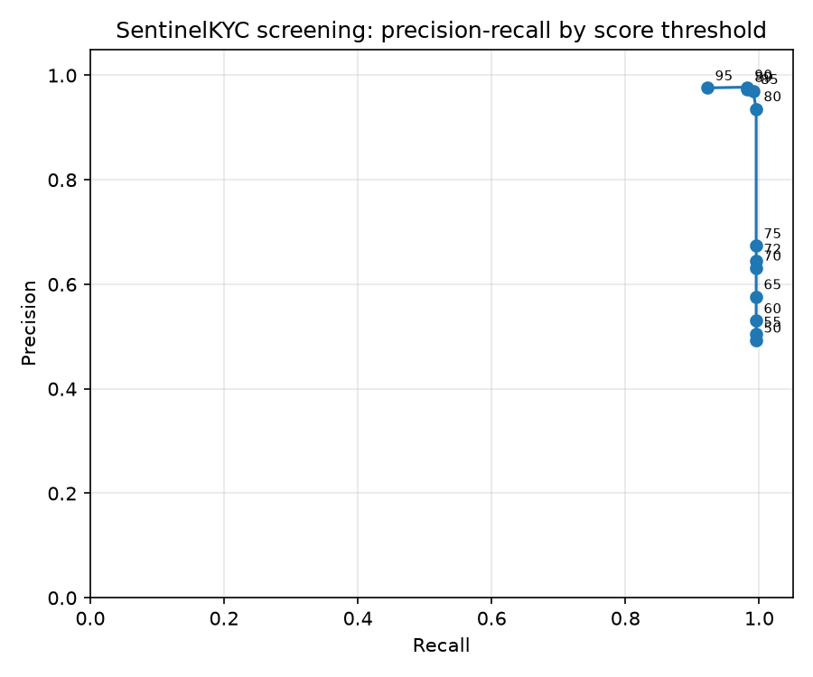

# Screening evaluation report

Ground truth set: 450 labelled queries (generated by dataset/scripts/generate_ground_truth.py, seed 42).

## Hybrid pipeline (token + trigram + vector retrieval, weighted composite score)

| Threshold | Recall | Precision | F1 | False positive rate | TP | FP | FN | TN |
|---|---|---|---|---|---|---|---|---|
| 50 | 0.995 | 0.493 | 0.660 | 0.978 | 219 | 225 | 1 | 5 |
| 55 | 0.995 | 0.505 | 0.670 | 0.935 | 219 | 215 | 1 | 15 |
| 60 | 0.995 | 0.530 | 0.692 | 0.843 | 219 | 194 | 1 | 36 |
| 65 | 0.995 | 0.576 | 0.730 | 0.700 | 219 | 161 | 1 | 69 |
| 70 | 0.995 | 0.631 | 0.772 | 0.557 | 219 | 128 | 1 | 102 |
| 72 | 0.995 | 0.644 | 0.782 | 0.526 | 219 | 121 | 1 | 109 |
| 75 | 0.995 | 0.674 | 0.804 | 0.461 | 219 | 106 | 1 | 124 |
| 80 | 0.995 | 0.936 | 0.965 | 0.065 | 219 | 15 | 1 | 215 |
| 85 | 0.991 | 0.969 | 0.980 | 0.030 | 218 | 7 | 2 | 223 |
| 89 | 0.982 | 0.973 | 0.977 | 0.026 | 216 | 6 | 4 | 224 |
| 90 | 0.982 | 0.977 | 0.980 | 0.022 | 216 | 5 | 4 | 225 |
| 95 | 0.923 | 0.976 | 0.949 | 0.022 | 203 | 5 | 17 | 225 |

## Baseline: pure rapidfuzz token_set_ratio over the same candidate pool

| Threshold | Recall | Precision | F1 | False positive rate |
|---|---|---|---|---|
| 50 | 0.950 | 0.514 | 0.667 | 0.861 |
| 55 | 0.950 | 0.536 | 0.685 | 0.787 |
| 60 | 0.950 | 0.559 | 0.704 | 0.717 |
| 65 | 0.950 | 0.584 | 0.723 | 0.648 |
| 70 | 0.950 | 0.606 | 0.740 | 0.591 |
| 72 | 0.950 | 0.630 | 0.757 | 0.535 |
| 75 | 0.950 | 0.641 | 0.766 | 0.509 |
| 80 | 0.950 | 0.661 | 0.780 | 0.465 |
| 85 | 0.950 | 0.661 | 0.780 | 0.465 |
| 89 | 0.950 | 0.663 | 0.781 | 0.461 |
| 90 | 0.950 | 0.663 | 0.781 | 0.461 |
| 95 | 0.895 | 0.650 | 0.753 | 0.461 |

## Result at the Review threshold (72)

- Hybrid pipeline recall: 0.995, false positive rate: 0.526
- Baseline recall: 0.950, false positive rate: 0.535

Recall at the Review threshold meets the Phase 3 target of at least 98 percent.

## Hybrid vs. baseline false positive rate at comparable recall

- Baseline's lowest false positive rate at any threshold, including where its own recall has already dropped below 95 percent, is 0.461.
- The hybrid pipeline reaches false positive rate 0.022 at threshold 90 while still holding recall at 0.982 (at or above 95 percent).
- Token-only matching cannot separate true matches from lookalikes once the score is inflated by shared common tokens; trigram and embedding retrieval plus the rare-token and secondary-attribute adjustments let the hybrid pipeline push the threshold higher without losing recall, which token_set_ratio alone cannot do.

